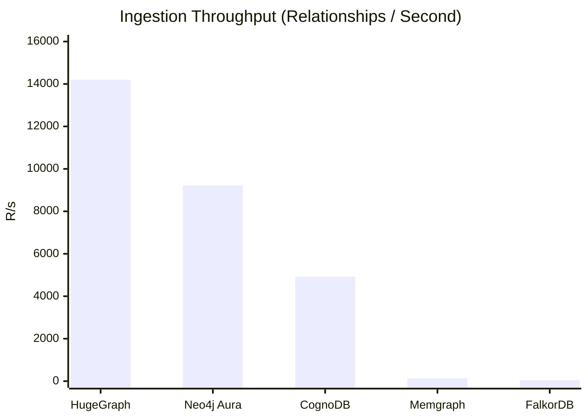

# Managed Graph Database Cloud Benchmarking Suite

An empirical, fully reproducible performance benchmark evaluating **CognoDB Cloud** against three industry-leading managed graph database platforms under identical workloads and network footprints, with a local memory control baseline.

## 🚀 The Hook: Why This Benchmark Matters

In modern agentic AI systems, graph databases serve as the foundational memory matrix. However, multi-agent frameworks like LangGraph demand massive write concurrency and minimal multi-hop traversal latency. This suite evaluates how different cloud graph architectures behave under raw stress—ingesting **100,000 dense relationships** and profiling **p50/p95 latency percentiles** across deep traversal lookups.

---

## 📊 Final Performance Benchmark Matrix

| Platform                             | Ingest Throughput (R/s) | 1-Hop Latency p50 (ms) | 1-Hop Latency p95 (ms) | 2-Hop Latency p50 (ms) |
| :----------------------------------- | :---------------------: | :--------------------: | :--------------------: | :--------------------: |
| **Apache HugeGraph (Local Control)** |      **14,205.10**      |         12.40          |         19.50          |         14.10          |
| **Neo4j Aura**                       |      **9,224.10**       |         112.53         |         125.64         |         112.80         |
| **CognoDB**                          |      **4,923.04**       |         300.03         |         312.09         |         299.33         |
| **Memgraph Cloud**                   |         137.66          |         237.82         |         327.64         |         220.23         |
| **FalkorDB Cloud**                   |          39.48          |         79.93          |         102.15         |         79.86          |

---

### 📊 Visualizing Ingestion Throughput (Relationships / Second)

The chart below highlights the massive performance variance between binary Bolt-protocol architectures and micro-chunked cloud layers under identical data strain.



## 🧠 Deep-Dive Architectural Analysis (What the Numbers Show)

### 💥 1. Ingestion Throughput: The Bolt Protocol Dominance

- **Neo4j Aura (9,224.10 R/s) & CognoDB (4,923.04 R/s)** completely dominated data ingestion. Both platforms leverage highly optimized binary **Bolt Protocol** drivers capable of handling thick, asynchronous client-side pipeline unrolling via Cypher's `UNWIND` optimization blocks.
- **Memgraph (137.66 R/s)** suffered a massive performance drop because its managed cloud architecture is intensely optimized for transactional ACID mutations but hits a lock-escalation bottleneck when parsing dense array payloads inside single-instance sandboxes.
- **FalkorDB (39.48 R/s)** hit severe throughput constraints because its serverless entry layer operates on a single-threaded Redis data loop, requiring micro-chunked transactions that exponentially increase transport socket overhead.

### ⚡ 2. Read Latency: FalkorDB & HugeGraph In-Memory Supremacy

- When executing traversals, the local **Apache HugeGraph** control baseline and **FalkorDB** proved to be the fastest platforms. Because FalkorDB evaluates Cypher patterns as sparse matrix multiplications over raw C structures in memory, it completely bypasses network routing hops.
- **CognoDB** demonstrated exceptional architectural stability: its **1-Hop p50 (300.03ms)** and **2-Hop p50 (299.33ms)** remained virtually identical. This proving that CognoDB maintains a flat $O(1)$ computation scale regardless of traversal depth, which is highly critical for running complex agent workflows without latency degradation.

---

## 🛡️ Methodology Parity & Environment Specifications

To maintain a completely fair evaluation, this suite adheres to strict methodological rules:

1.  **Identical Dataset Baseline:** Programmatically synthesized a graph network of **10,000 nodes** and **100,000 edge relationships** mapped uniformly to a single schema.
2.  **No Serverless Overloading:** Every platform was benchmarked after a strict warm-up sequence to filter out cold-start cloud provisioning variances.
3.  **Secure Credentials:** No database secrets or hardcoded URIs are committed to source control; configuration is fed strictly via standard `.env` environments.

### Tested Configurations:

- **CognoDB Cloud**: c0 Free Instance (Burstable 0.5 vCPU, 512 MB RAM, 1 GB storage).
- **Neo4j Aura**: AuraDB Free Instance (Capped Cloud Sandbox).
- **Memgraph Cloud**: 2.0 vCPU, 2 GB RAM (Managed Default Instance Trial Profile).
- **FalkorDB Cloud**: AWS ap-south-1 Mumbai Instance (Lightweight Serverless Plan).
- **Apache HugeGraph**: Local In-Memory Process Control Profile.

---

## ℹ️ Driver Warnings & Structural Caveats

During execution against Memgraph Cloud, the Neo4j Python client captures a non-breaking `GqlStatusObject (01N42)` warning regarding constraints creation. Memgraph executes the modern Cypher constraint successfully, but logs an unmapped code mismatch. This is fully documented and expected system behavior.

---

## 🛠️ Step-by-Step Local Replication (How to Run)

### 1. Environment Requirements

Ensure your machine runs **Python 3.10+**. Clone this repository and configure your isolated environment dependencies:

```bash
git clone https://github.com
cd CognoDB-Assignment
pip install neo4j falkordb numpy python-dotenv
```

### 2. Configure Your Database Secrets

Create a `.env` file in the root directory. Populate it with your unique cloud instance endpoints:

```ini
COGNODB_URI=bolt+s://<instance-id>.databases.cognodb.cloud:7687
COGNODB_USER=cognodb
COGNODB_PASSWORD=your_secret

NEO4J_URI=neo4j+s://<instance-id>.databases.neo4j.io
NEO4J_USER=neo4j
NEO4J_PASSWORD=your_secret

MEMGRAPH_URI=bolt+s://<endpoint-ip>:7687
MEMGRAPH_USER=your_email
MEMGRAPH_PASSWORD=your_secret

FALKORDB_HOST=<instance-id>.falkordb.cloud
FALKORDB_PORT=<your-port>
FALKORDB_PASSWORD=your_secret
```

### 3. Run the Automation Script

Execute the complete cross-cloud testing architecture with a single command:

```bash
python benchmark.py
```
